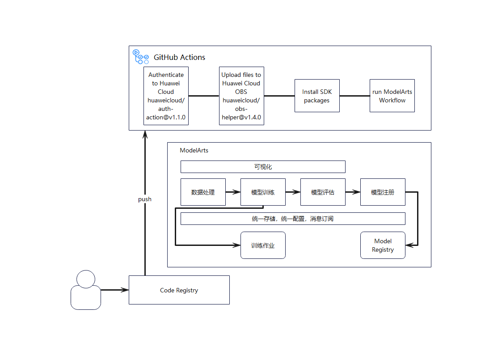

# pipeline_col
此工程用来验证使用github Actions来构建华为云AI平台ModelArts训练流水线，意在帮助开发者以更低门槛使用ModelArts平台与Github Actions结合的方式持续迭代与构建属于自己的AI应用。

本代码仓作为案例的载体，通过CodeArts提供的代码托管和持续构建的能力，与ModelArts Workflow一起打通MNIST的持续训练实践。

## 整体架构

Github Actions是Github的持续集成和持续交付平台，可用于自动执行生成、测试和部署管道。Actions以yml的形式进行定义，开发者可以定义触发actions的行为、actions里面运行组件与顺序。如果使用的目标没有组件，还可以通过在环境中运行目标的CLI/SDK等完成操作。\
此工程定义通过【push】这一动作，触发流水线运行。流水线使用了华为云鉴权的actions进行认证，OBS actions进行脚本文件上传，并安装ModelArts SDK运行需要的SDK包，然后执行ModelArts Workflow。在执行ModelArts Workflow时，会触发华为云上的ModelArts Workflow发布和运行。

完成上述步骤后，开发者可以在ModelArts的console页面的workflow服务中查看到相应的workflow。后续便可以轻松在页面完成训练效果的查看，定时运行的配置以及运行消息的订阅。对于效果不尽如人意的情况，开发者便可以返回git代码仓中进行参数，数据甚至代码的调整，并通过git的commit动作自动触发构建工作流的执行，快速地完成持续训练的动作。

## 目录结构
```txt
├─.github
|  └─workflows
|     └─connect-ma.yaml
|
├─data													
│  └─MNIST
│      ├─processed
│      │   ├─test.pt
│      │   └─training.pt
│      └─raw
│          ├─t10k-images-idx3-ubyte
│          ├─t10k-labels-idx1-ubyte
│          ├─train-images-idx3-ubyte
│          └─train-labels-idx1-ubyte
│              
├─docker-image													
│  ├─Dockerfile
│  ├─Miniconda3-py37_4.12.0-Linux-x86_64.sh
│  └─pip.conf
│    
├─images
|  └─整体架构.png
|
├─util													
│  ├─__init__.py
│  └─metric.py
│        
├─requirements
|  ├─modelarts_workflow-1.0.0-py2.py3-none-any.whl
|  ├─modelarts-1.4.15-py2.py3-none-any.whl
|  └─requirements.txt
|
├─README.md
├─training.py
└─workflow.py
```
- data：业界知名的MNIST数据集，来源：http://yann.lecun.com/exdb/mnist

  > 注意：
  >
  > 由于本案例中数据集容量较小，为了更方便地训练模型，直接将数据集用代码仓进行了纳管。如果真实场景中数据集容量较大，不建议通过代码仓纳管数据集。最好使用华为云OBS或者ModelArts数据管理服务管理数据集。

- docker-image：构建ModelArts训练镜像的原材料，包含了镜像文件Dockerfile，以及Miniconda3的安装包和华为云官方pip源。

- images：文档图片存储

- requirements：ModelArts SDK运行安装包

- util：ModelArts提供的用于在workflow中进行指标管理和可视化的工具包，通过MetricLogger类可以帮助开发者便捷地管理训练过程中产生的指标。


- README.md：项目介绍

- training.py：Pytorch官方手写数字识别模型训练代码，来源：[examples/mnist at main · pytorch/examples (github.com)](https://github.com/pytorch/examples/tree/main/mnist)

- workflow.py：ModelArts Workflow编排代码

## Github Actions详解

华为云统一鉴权认证，参考(https://github.com/marketplace/actions/authenticate-to-huawei-cloud)
```
      - name: Authenticate to Huawei Cloud
        uses: huaweicloud/auth-action@v1.0.0
        with: 
          access_key_id: ${{ secrets.ACCESSKEY }}
          secret_access_key: ${{ secrets.SECRETACCESSKEY }}
          region: 'cn-north-4'
```

华为云OBS上传，参考(https://github.com/marketplace/actions/huawei-cloud-obs-helper)
```
      - name: Upload To HuaweiCloud OBS
        uses: huaweicloud/obs-helper@v1.3.0
        with:
          bucket_name: 'dxh'
          local_file_path: |
            ./data
            ./image
            ./util
            ./training.py
            ./workflow.py
          obs_file_path: github-actions-demo
          operation_type: 'upload'
          include_self_folder: true
```

当前ModelArts暂无提供Actions，但我们仍可以在actions执行环境中安装依赖包后，使用SDK编排ModelArts的运行逻辑
```
- name: Build and deploy model
        run: |
          cd requirements
          pip3 install -r requirements.txt
          cd ..
          python3 ./workflow.py
```